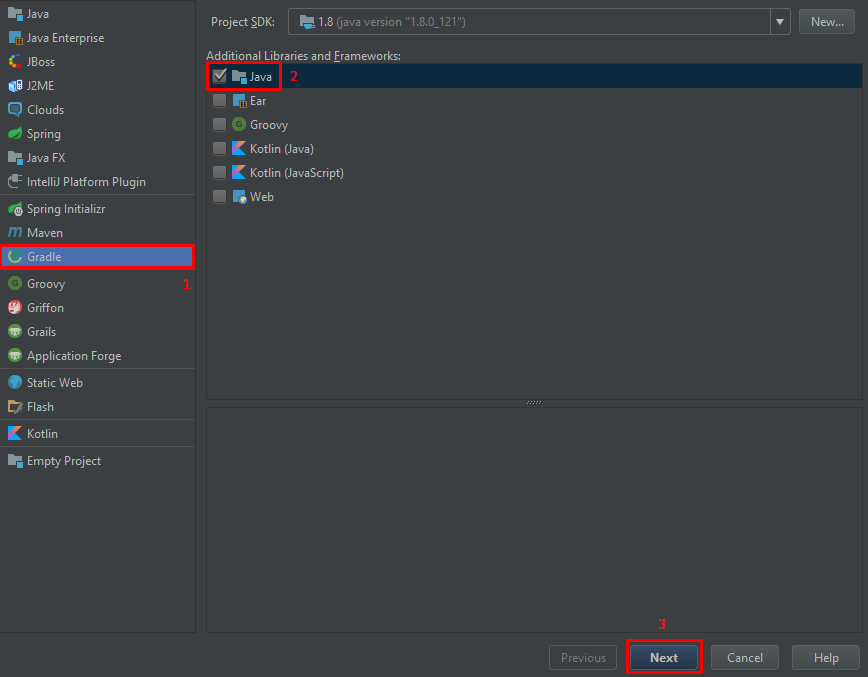
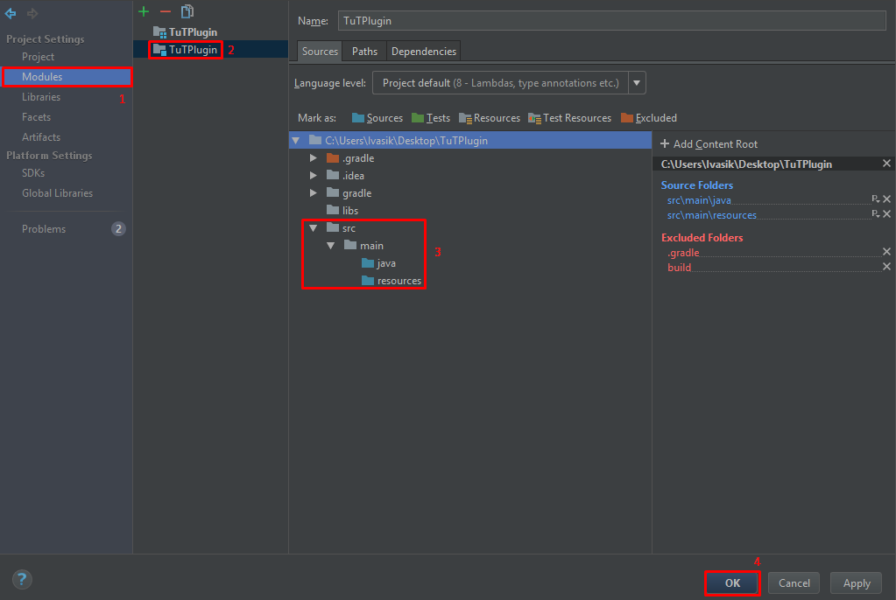
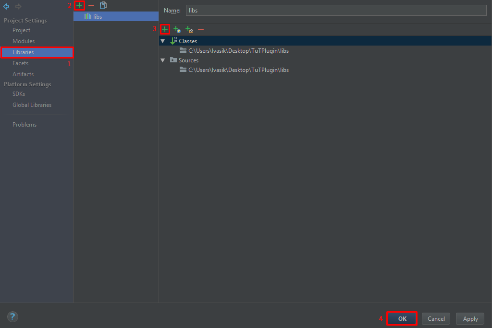

# Установка программ

Minecraft написана на языке Java. Программы на этом языке могут выполняться только если у вас установлена виртуальная машина Java.

Если вы хоть раз запускали Minecraft на данном компьютере, то Java у вас уже установлена. В противном случае, скачайте и установите [последнюю версию Java](https://java.com/ru/download/).

## JDK

Для запуска Minecraft необходима лишь среда выполнения Java, которую вы установили выше.

Но для разработки собственных плагинов нам потребуется писать программный код и пользоваться разными библиотеками. Это не входит в стандартный Java пакет,
поэтому нам нужно установить JDK (Java Development Kit) (Комплект инструментов для разработки на Java).

Скачайте [последнюю версию JDK](http://www.oracle.com/technetwork/java/javase/downloads/jdk8-downloads-2133151.html) и следуйте инструкциям по установке. Ничего в настройках установки менять не надо.

## Среда разработки

Моды можно писать и в блокноте, но это очень неудобно. Нам нужна специализированная программа, которая
умеет подсвечивать код, выполнять авто-импорт и делать много других полезных вещей.

Наиболее популярными IDE на данный момент являются [Eclipse](https://www.eclipse.org/downloads/) и [Intellij Idea](https://www.jetbrains.com/idea/#chooseYourEdition).

Eclipse бесплатен. У Intellij Idea есть бесплатная Community версия. Никаких платных функций в этом учебнике нам не потребуется.

Достаточно часто моды пишут на Eclipse, так как и сам Minecraft был написан с помощью этой IDE.
С другой стороны, Idea выглядит посовременнее и пофункциональнее, но принципиальной разницы между ними нет.

Выбирайте то, что нравится вам.

## Настройка Intellij Idea

В самой среде разработки открываем File -> New -> New Project. Выбираем систему автоматической сборки Gradle(Если вы разбираетесь в других системах, то можете выбрать их)
в самом окне ставим галочку напротив "Java" и нажимаем "Next".


В следующем окне заполняем поля GroupID - TuTPlugin, ArtifactsID - TuTPlugin и нажимаем "Next" пока не появится кнопка "Finish". Всё, установка рабочей среды
окончена! Теперь осталось дождаться загрузки модуля Gradle.

Создадим две папки: libs и src, в нашем рабочем пространстве. В libs мы будем помещать плагины которые хотим использоваться как библиотеки. В src будут храниться исходники
нашего плагина. Папка src должна иметь такой вид:
```md
└── src    
    └── main
        ├── java
        └── resources
```
В java находятся сами исходники, а в resources конфиги, папки и прочее. Открываем настройки проекта с плагином(F4) и в категории Project Setting выбираем Modules.
Выбираем наш модуль TuTPlugin открываем папку src и в папки main выделяем java и resources и нажимаем на Sources.

И теперь добавляем папку libs как библиотеку:


## Использование BungeeCord API

Перейдём в репозиторию [BungeeCord](https://ci.md-5.net/job/BungeeCord/) с ядрами BungeeCord и загрузим актуальную версию ядра.

После того как Вы скачали BungeeCord.jar переместим его в папку libs в нашем проекте.

На этом основные настройки закончены!
