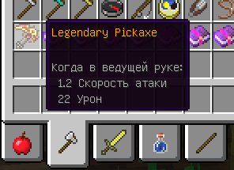

# Редкость предметов

### Что надо знать
* [Создание предмета](../creating_item)

---

В Minecraft цвет большинства предметов белый. Однако, цвет зачарованных инструментов меняется на алмазный.
Цвет зачарованной книги желтый.

За цвет названий предметов отвечает редкость `rarity` этого предмета. Редкость отвечает **только** за цвет названия.

## Зачем использовать редкость?

Цвет названия предмета можно установить через .lang файл используя [коды форматирования](http://minecraft.gamepedia.com/Formatting_codes).

Вот так можно получить оранжевое название предмета для "Легендарной кирки":

```markdown
item.itemTest.name=§4Legendary Pickaxe
```

Но что если вы создаете большой RPG мод, в котором есть легендарные, божественные, невероятные и т.д. предметы?

Можно проставлять цветовые коды перед каждым названием, но что если в один день вы решили изменить цвет легендарных предметов?
Придется менять у всех предметов из этой категории менять название. Неудобно.

С помощью системы редкости вам достаточно будет поменять цвет в одном месте и он сразу изменится у все предметов, которые
находятся в этой категории редкости.

## Регистрация редкости

Добавим в файл предметов строку:

```java
// Items.java

public static EnumRarity RARITY_TUTORIAL = EnumHelper.addRarity(name, color, displayName);
```

Разберем аргументы:
* `name` (строка) — название класса предмета
* `color` (`TextFormatting`) — цвет названия предмета
* `displayName` (строка) — название редкости предмета

Добавим "Легендарную" редкость предметов. Названия должны окрашиваться в золотой цвет:

```java
// Items.java

public static EnumRarity RARITY_LEGENDARY = EnumHelper.addRarity("RARITY_LEGENDARY", TextFormatting.GOLD, "Legendary");
```

## Применение к предмету

В файле предмета нужно реализовать метод `getRarity`:

```java
// ItemTest.java

public EnumRarity getRarity(ItemStack stack) {
    return Items.RARITY_LEGENDARY; // Созданная нами группа редкости
}
```

Теперь название предмета оранжевого цвета:



