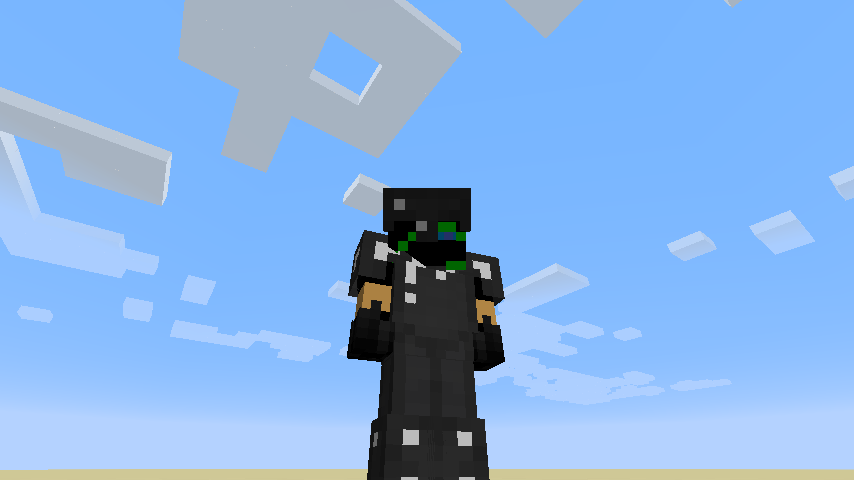

# Создание брони

## Основа

Создадим класс брони ItemMagicArmor.
```java
public class ItemMagicArmor extends ItemArmor
{
    public ItemMagicArmor(String name, ArmorMaterial materialIn, int renderIndexIn, EntityEquipmentSlot equipmentSlotIn)
    {
        super(materialIn, renderIndexIn, equipmentSlotIn);
        this.setRegistryName(name);
        this.setUnlocalizedName(name);
    }
}
```

`ArmorMaterial` - это то же, что и ToolMaterial, только для брони.
`renderIndexIn` - это индекс рендера, всего существует два индекса. 1 - Отвечает за шлем, нагрудник, ботинки. 2 - Отвечает за штаны.
`equipmentSlotIn` - эта переменная задаёт слот в который можно будет положить нашу броню. Всего существует шесть видов слотов и только четыре предназначены исключительно для брони.

Создадим наш ArmorMaterial
```java
public static ItemArmor.ArmorMaterial armorMaterial = EnumHelper.addArmorMaterial("tut:armor", "tut:armor", 9, new int[]{2, 4, 6, 3}, 7, SoundEvents.ITEM_ARMOR_EQUIP_IRON, 2.0F).setRepairItem(new ItemStack(Item.getItemFromBlock(Blocks.OBSIDIAN)));
```

`tut:armor` - это название нашего материала, лучше указывать ещё modid, чтобы не возникало конфликтов с Minecraft.
`tut:armor` - это название текстуры которое будет преобразовано в armor_layer_1 и armor_layer_2. Цифра обозначает индекс рендера.
`9` - это прочность брони.
`int[]` - это то на сколько будет быстро убавляться прочность одного из элементов брони. С начала идёт шлем = 2, нагрудник = 4, штаны = 6, ботинки = 3. Получается, что при ударе по нашей броне из прочности будет вычитаться для шлема = 2, нагрудника = 4, штанов = 6, ботинок = 3.
`7` - это уровень который требуется для получения более лучших чар для брони.
`SoundEvents` - это звуки которые будут проигрываться при надевании брони.
`2.0F` - это ударопрочность брони. (Сколько сможет броня поглотить в себя урона)

Зарегистрируем нашу броню. Примерно должно выглядить так
```java
public static Item
            BOOTS = new ItemMagicArmor("boots", armorMaterial, 1, EntityEquipmentSlot.FEET),
            LEGGS = new ItemMagicArmor("leggs", armorMaterial, 2, EntityEquipmentSlot.LEGS),
            CHESTPLATE = new ItemMagicArmor("chestplate", armorMaterial, 1, EntityEquipmentSlot.CHEST),
            HEAD = new ItemMagicArmor("head", armorMaterial, 1, EntityEquipmentSlot.HEAD);
```

`boots` - это название элемента брони
`armorMaterial` - это материал брони
`1` - это индекс рендера
`EntityEquipmentSlot` - это слот в который можно будет положить наш элемент брони.

Нам нужно создать текстуру для брони.


Положим наши текстуры по пути:
```md
└── src    
    └── main
        └── resources
            └── assets
                └── tut
                    └── textures
                        └── models
                            └── armor
```

Запускаем игру, выдаём себе броню и надеваем.



## Броня с моделью

В данном разделе вы научитесь создавать броню с моделью, т.е. не такую как мы в статье выше делали, а именно с моделью.

Создадим модель брони. Это можно сделать с помощью [CubikStudio](https://cubik.studio/get) | [Qubble](https://mods.curse.com/mc-mods/minecraft/247648-qubble/2344113) | [Tabule](http://ichun.me/mods/tabula-minecraft-modeler/).

Добавим в наш класс ItemMagicArmor метод getArmorModel().
```java
@Override
@SideOnly(Side.CLIENT)
public ModelBiped getArmorModel(EntityLivingBase entityLiving, ItemStack itemStack, EntityEquipmentSlot armorSlot, ModelBiped model)
{
    ModelBiped armorModel = ItemsRegister.armorModels.get(this);

    if (armorModel != null)
    {
        armorModel.bipedHead.showModel = armorSlot == EntityEquipmentSlot.HEAD;
        armorModel.bipedHeadwear.showModel = false;
        armorModel.bipedBody.showModel = armorSlot == EntityEquipmentSlot.CHEST || armorSlot == EntityEquipmentSlot.LEGS;
        armorModel.bipedRightArm.showModel = armorSlot == EntityEquipmentSlot.CHEST;
        armorModel.bipedLeftArm.showModel = armorSlot == EntityEquipmentSlot.CHEST;
        armorModel.bipedRightLeg.showModel = armorSlot == EntityEquipmentSlot.LEGS || armorSlot == EntityEquipmentSlot.FEET;
        armorModel.bipedLeftLeg.showModel = armorSlot == EntityEquipmentSlot.LEGS || armorSlot == EntityEquipmentSlot.FEET;

        armorModel.isSneak = entityLiving.isSneaking();
        armorModel.isRiding = entityLiving.isRiding();
        armorModel.isChild = entityLiving.isChild();
    }
    return armorModel;
}
```

Перейдём в класс ItemsRegister и создадим переменную armorModels.
```java
public static final Map<Item, ModelBiped> armorModels = new HashMap<>();
```
