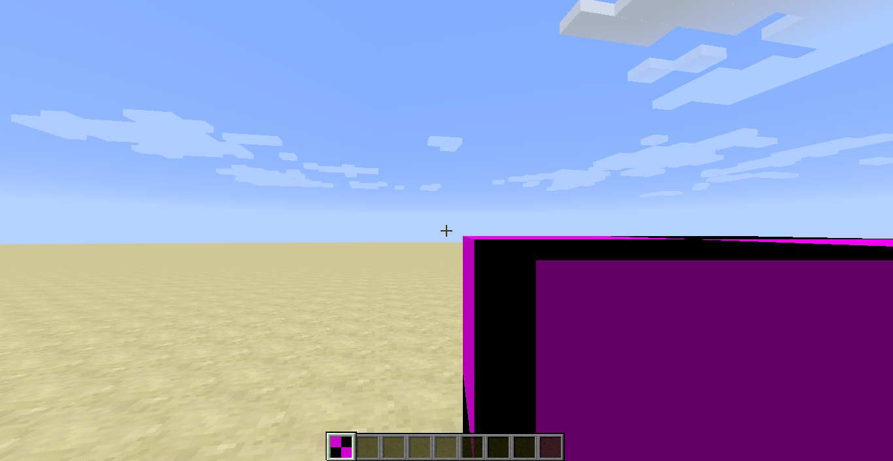
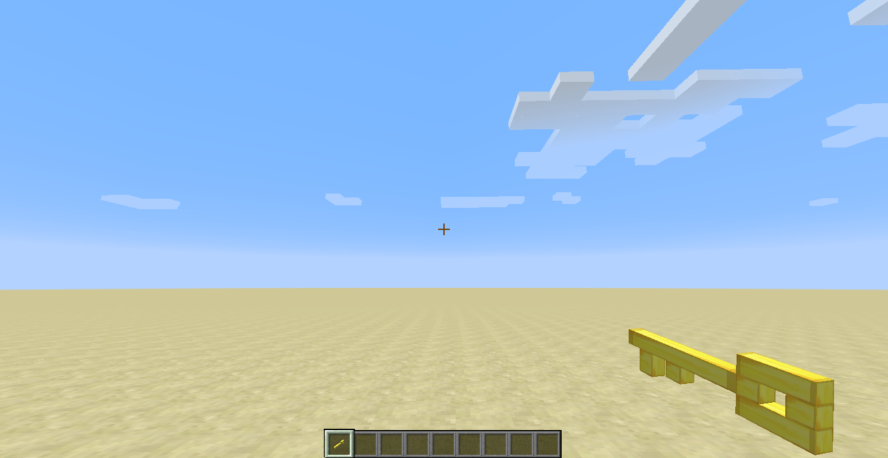
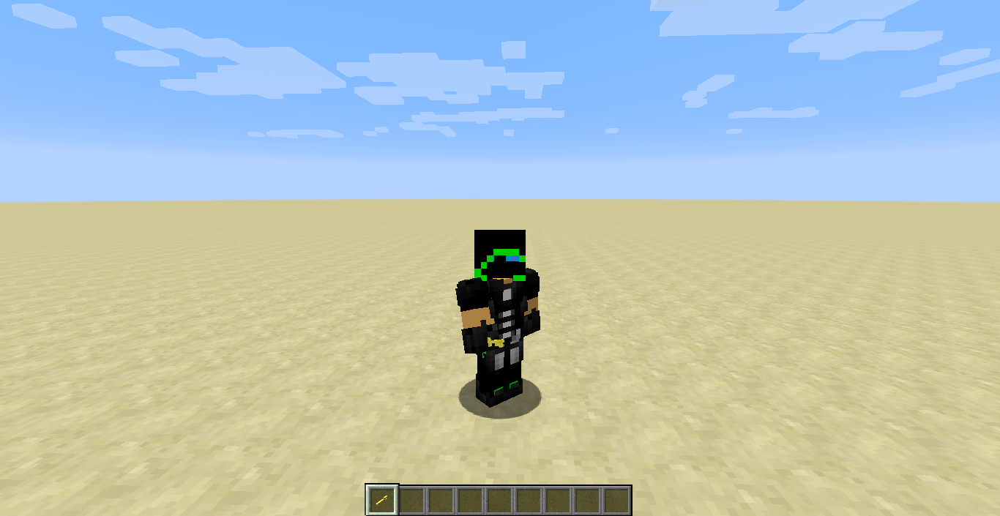

# Создание предмета

## Основа создания предмета

Создадим класс для нашего предмета.

```java
public class ItemKey extends Item
{
    public ItemKey(String name)
    {
        this.setRegistryName(name);
        this.setUnlocalizedName(name);
    }
}
```

## Основа создания блока

Создадим класс для нашего блока.

```java
public class BasicBlock extends Block
{
    public BasicBlock(final Material materialIn, final String)
    {
        super(materialIn);
        this.setRegistryName(name);
        this.setUnlocalizedName(name);
        this.setHarvestLevel(hravLevel, level);
        this.setHardness(4.0F);
    }
}
```
* `setRegistryName(name)` - задаёт регистрируемое имя для нашего предмета, т.е. данное имя будет зарегистрировано в игре и его нельзя будет уже использовать более. В игре будет отображаться как `modid:*item_name*`. Чтобы это увидеть нажмите сочетание клавиш `F3+H`
* `setUnlocalizedName(name)` - задаёт локализационное имя для нашего предмета, т.е. чтобы нам сделать перевод имени для предмета мы задаём имя которое будет в конечном итоге выглядеть вот так `item.*item_name*.name`.
* `setHarvestLevel(hravLevel, level)` - `hravLevel` - задаёт каким инструментом будет ломатся блок, к примеру киркой `pickaxe`,   `level` - задаёт какой уровень инструмента должен быть, что бы сломать блок, к примеру 0 это деревянная кирка и выше.
* `setHardness(4.0F)` - задаёт прочность предмета.
 
## Регистрация

### Регистрация предмета
Создадим класс ItemsRegister.

```java
public class ItemsRegister
{
    public static Item KEY = new ItemKey("key");

    public static void register()
    {
        setRegister(KEY);
    }

    public static void registerRender()
    {
        setRender(KEY);
    }

    private static void setRegister(Item item)
    {
        ForgeRegistries.ITEMS.register(item);
    }

    private static void setRender(Item item)
    {

    }
}
```

* `setRegister(item)` - данный метод будет регистрировать наш предмет
* `setRender(item)` - данный метод будет регистрировать модель для нашего предмета

### Регистрация блока
Создадим класс BlocksRegister.

```java
public class BlocksRegister
{
    public static Block BASICBLOCK = new BasicBlock("basicblock");

    public static void register()
    {
        setRegister(BASICBLOCK);
    }

    public static void registerRender()
    {
        setRender(BASICBLOCK);
    }

    private static void setRegister(Block block)
    {
        ForgeRegistries.BLOCKS.register(block);
        ForgeRegistries.ITEMS.register(new ItemBlock(block).setRegistryName(block.getRegistryName()));
    }

    private static void setRender(Block block)
    {

    }
}
```

* `setRegister(block)` - данный метод будет регистрировать наш блок.
* `setRender(block)` - данный метод будет регистрировать модель для нашего блок.

Как Вы уже могли заметить, то теперь вместо GameRegistry используется ForgeRegistries, который делит регистрацию предметов, сущностей, блоков и т.д.

Далее нам нужно добавить в CommonProxy, в метод preInit такую строку кода `ItemsRegister.register();` и `BlocksRegister.register();`.

Теперь можете запустить Minecraft нажав на кнопку `run` и посмотреть свой предмет в живую. Чтобы получить предмет или блок пропишите `/give @p tut:key`.
Вместо `tut` у Вас должен быть `modid` вашего мода! Вместо `key` у Вас должно быть регистрируемое имя вашего предмета или блока.




## Модель

Для предмета добавим такой код в ItemsRegister, в метод setRender
```java
Minecraft.getMinecraft().getRenderItem().getItemModelMesher().register(item, 0, new ModelResourceLocation(item.getRegistryName(), "inventory"));
```
Для блока добавим такой код в BlocksRegister, также в метод setRender
```java
Minecraft.getMinecraft().getRenderItem().getItemModelMesher().register(Item.getItemFromBlock(block), 0, new ModelResourceLocation(block.getRegistryName(), "inventory"));
```

Теперь Вы должны создать модель предмета, Вы можете создать как плоскую модель, примером может послужить яблоко или объёмную модель. Вот пример плоской модели:

```json
{
  "parent": "item/generated",
  "textures": {
    "layer0": "tut:items/key"
  }
}
```

[Объёмная модель](https://yadi.sk/d/JNFq9Y4h3KcrBv)

Если ваша текстура к модели берётся из самого Minecraft, то `tut:`(modid) прописывать не надо! В пример с объёмной моделью я решил использовать текстуру золотого блока из Minecraft.

`key` - регистрируемое имя нашего предмета.

Когда ваша модель готово, добавьте её по пути:
```md
└── src    
    └── main
        └── resources
            └── assets
                └── tut
                    └── models
                        └── item
```

`tut` - modid нашего мода.

Добавим в ClientProxy, в метод init такой код  `ItemsRegister.registerRender();`.

И вот, что в конечном итоге у нас может получится.




Так же Вы должны создать модель блока, Вы так же можете создать как плоскую, так и объёмную модель. Вот пример плоской модели:

```json
{
    "parent": "block/cube_all",
    "textures": {
        "all": "tut:blocks/basicblock"
    }
}
```

`basicblock` - регистрируемое имя нашего предмета.

Когда ваша модель готово, добавьте её по пути:
```md
└── src    
    └── main
        └── resources
            └── assets
                └── tut
                    └── models
                        └── block
```
Теперь Вы должы создать "статус блока", т.е. с помощью файлов Вы сможете изменять блок в зависимости от разных ситуаций.Вот одна "стата" к примеру:
```json
{
    "variants": {
        "normal": {
            "model": "tut:basicblock"
        }
    }
}
```
Когда ваша "стата" готово, добавьте её по пути:
```md
└── src    
    └── main
        └── resources
            └── assets
                └── tut
                    └── blockstates
                        
`tut` - modid нашего мода.

Добавим в ClientProxy, в метод init такой код  `BlocksRegister.registerRender();`.
